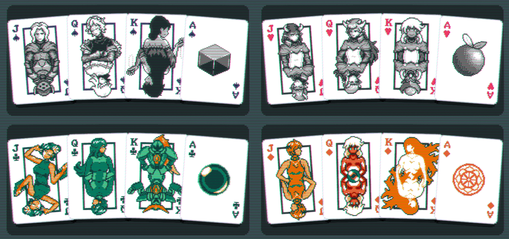

# System Erasure Face Cards

This mod for **Balatro** adds skins for each suit with art of characters from [**System Erasure**](https://se-made.com/)'s games, **ZeroRanger** and **Void Stranger**.

## Install

1. Ensure you have [Steamodded](https://github.com/Steamodded/smods) downloaded.
2. Download the [release](https://github.com/gPhantasm/Balatro-SEDeck/releases/latest).
3. Extract to `%AppData%/Balatro/Mods`.
4. Open Balatro.

## Credits

Art by AndyPandy27. High contrast versions by gooeyPhantasm.

Template for deck skins by Victin.

Characters by System Erasure.
